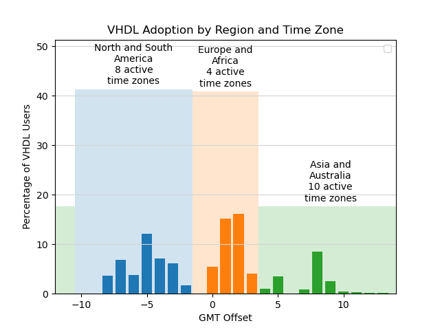

(ref:repoTree) github.com/LarsAsplund/github-facts/tree/master

# What Can GitHub Tell Us About the HDL Industry? {#index}

```{r adaption, echo=FALSE, out.width = '85%', fig.align='center'}

```

During the last few years we've had many discussions within the **VUnit** community where we failed to reach a conclusion because we don't fully know how people at large are working with design and verification. Some questions arise frequently:

* How is verification done?
* What frameworks are used? Are they used together?
* What are the dominant coding styles? Would people align to those if they knew?

Knowing these would help the development of VUnit [@vunit]; where do we put our efforts? do we add functionality or reuse functionality from others? where does it make sense to create tighter integrations with other tools? can we avoid spending time on endless indentation and casing discussions? Just let a tool fix it and move on.

It's not hard to find strong opinions in every possible direction, but we are looking for more solid facts. Facts can be found where data is, and one of the biggest pile of easy accessible data is GitHub. For that reason, this repository contains the mining effort to gather relevant information. Any information about projects related to HDL has been retrieved and processed.

In the first chapter of this series, verification practices are discussed.
