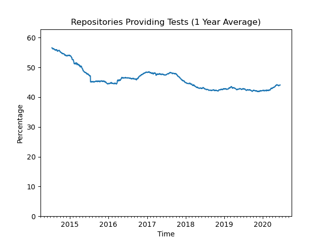
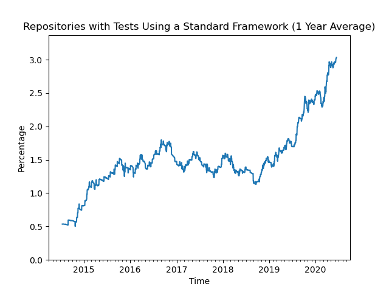

## Repository Analysis

```{r, echo=FALSE}
library(reticulate)
```
```{python, echo=FALSE}
from pathlib import Path
from json import load

repos_stat_path = Path.cwd() / "repos_stat.json"
with open(repos_stat_path) as json:
    repos_stat = load(json)

total_n_vhdl_files = repos_stat["total_n_vhdl_files"]
total_n_repos = repos_stat["total_n_repos"]
```

When scanning GitHub for VHDL repositories, **`r py$total_n_vhdl_files` VHDL files** were found in **`r py$total_n_repos` repositories**. These repositories were initially analyzed for two things:

1. **Are tests provided?** This was a simple analysis just looking for VHDL files containing anything with *test* or *tb*.
2. **Are any of the standard frameworks used (VUnit, UVM, UVVM, OSVVM and/or cocotb)?** There have been discussions regarding the use of the term "standard(ized)"; so, to be clear, we mean *standard* as in well-established within the community, not as in standardized.

```{python, echo=FALSE}
n_repos_with_tests = 0
for data in repos_stat["repo_stat"].values():
    if data["test_strategies"] or data["has_tests"]:
        n_repos_with_tests += 1

percentage_repos_with_tests = round(100 * n_repos_with_tests / total_n_repos)
```

The first analysis (see Figure \@ref(fig:repositories)) revealed that roughly **`r py$percentage_repos_with_tests`% of all repositories provide tests** for their code and that the trend is declining.

```{r repositories, fig.cap='Repositories providing tests.', echo=FALSE, out.width = '85%', fig.align='center'}

```

```{python, echo=FALSE}
percentage_without_test_naming = round(100 * repos_stat["n_repos_with_standard_vhdl_strategy_but_no_obvious_test_files"] / repos_stat["n_repos_with_standard_vhdl_strategy"])
```

Just looking at the file names is not optimal. **`r py$percentage_without_test_naming`% of the repositories using a standard VHDL-based framework (VUnit, UVVM or OSVVM) do not use such a naming convention**. However, it gives us a ballpark figure and a trend.

The second analysis (see Figure \@ref(fig:standard)) looked at the repositories providing tests and calculated the percentage of them that are using at least one of the standard verification frameworks. This trend is increasing rapidly over the last few years.

```{r standard, fig.cap='Repositories using standard frameworks.', echo=FALSE, out.width = '85%', fig.align='center'}

```

Look at the vertical axis though. While the trend is impressive, the absolute numbers are not. **Only 3% of the repositories with tests created last year use a standard verification framework**.

This may come as a surprise. Many engineers working professionally with VHDL would probably say that verification is getting more and more important and that the majority is using a standard framework. Does this mean that GitHub data should be discarded as a relevent indicator for the professional world? There are at least three good reasons not to do so:

1. Our beliefs are based on our experiences, and our experiences are often based on our interactions with a limited group of people. This group of people may not be a good representation of the whole VHDL community, for example due to regional differences.
2. The tendency to only accept our own beliefs is called [confirmation bias](https://en.wikipedia.org/wiki/Confirmation_bias) and is deeply rooted in the human nature. We need to be aware that it exists and try to look beyond it.
3. Not all GitHub repositories are developed by professionals, but some are. We cannot expect GitHub to be a perfect reflection of the professional world but we can expect signs from that world.

In the following sections, we will dig deeper into the data to see what frameworks and combination of frameworks people are using. We will also compare those findings to the results presented in the *Wilson Research Group functional verification study* [@wilson18].

### How-To

The results presented so far were compiled using the scripts presented in the following sections.

#### `github_search.py` {#github-search}

[`github_search.py`](https://(ref:repoTree)/py/github_search.py) is used to search GitHub for all repositories containing files of a specific language and matching a specified query. To find all repositories containing VHDL files one can specify `end` as the query since all VHDL files contain that key word. The result of the search is listed in text files stored in `result_directory`. A GitHub user name and a Github [access token](https://help.github.com/en/github/authenticating-to-github/creating-a-personal-access-token-for-the-command-line) must also be provided to access the GitHub API.

``` console
python github_search.py \
  vhdl end result_directory \
  YourGitHubUser your_github_access_token
```

The GitHub API has a number of restriction on searches. One is that you cannot get the full result of the search if the result contains more than 1000 files. To handle that, every search is further restricted by the script to only target files in a limited size range. First files between 1 - n bytes are searched where n is the largest number resulting in less than 1000 files, then files in a range starting with n + 1 bytes are searched and so on until the maximum searchable file size of 384 kB has been included. The accumulated search result after every such increment is stored in a separate file in `result_directory` and only the last produced file contains the full result.

Occasionally there are more than 1000 found VHDL files of a single size, for example 264 bytes. In these cases some results are lost but most likely the repositories containing those missing files have other VHDL files caught in another search increment; so this will not have a significant effect on the overall statistics.

The GitHub API also has rate limitations, which means that searches with many results take a long time to complete. Searching for all VHDL files takes days but the more limited searches for specific verification frameworks that we will use later can complete in minutes. If you interrupt a longer search and restart it later `github_search.py` will look at the intermediate result files in `result_directory` and continue from where it was interrupted.

The result from the latest search for all VHDL files is found in [`all_vhdl_repos.txt`](https://(ref:repoTree)/all_vhdl_repos.txt)

#### `github_clone.py`

[`github_clone.py`](https://(ref:repoTree)/py/github_clone.py) makes a clone of all repositories listed in a file such as those produced by `github_search.py` (\@ref(github-search)). The clone is sparse and only contains VHDL, SystemVerilog and Python files, which are the ones used for this study. The sparse clone is also stripped from its `.git` directory, and zipped to save storage space. The script also stores some basic information about the repository.

A call to the script looks like this:

``` console
python github_clone.py \
  repository_list result_directory \
  YourGitHubUser your_github_access_token
```

If `repository_list` contains a repository `foo/bar`, the script will create a directory `foo` under `result_directory` and in that directory the zipped repository as `bar.zip`. The basic repository information is stored in a JSON file named `bar.basic.1.json`.

Cloning all VHDL repositories from GitHub takes several days and requires about 180 GB of storage. Due to that size, it has not been possible to share the data. Anyone interested in analyzing those repositories needs to recreate the data locally, using this script and the [all_vhdl_repos.txt](https://(ref:repoTree)/all_vhdl_repos.txt) repository list.

#### `analyze_test_strategy.py` {#analyze-test-strategy}

[`analyze_test_strategy.py`](https://(ref:repoTree)/py/analyze_test_strategy.py) analyzes the cloned repositories and generates the statistics presented in this work. The initial search for repositories using any of the standard frameworks is automatic but also produces a number of false positives that must be removed manually:

- A repository with both VHDL and (System)Verilog files that is also using UVM or cocotb may not use these frameworks to verify the VHDL code. VUnit can also be used for (System)Verilog verification but the search script can distinguish and ignore such repositories to avoid false positives.
- Sometimes the main design being verified is based on (System)Verilog but it also includes third party IPs written in VHDL. This is considered a false positive since the IPs are not the target for the verification and the design language of choice is not VHDL.
- Some repositories have testbenches based on a standard framework but the purpose is not to verify VHDL code but rather to use the code for testing an EDA tool being developed. A parser for example.
- This study is focused on the users of the frameworks, not the developers. The repositories hosting the frameworks and copies of these repositories have been excluded.

The false positives are listed in [`fp_repos.json`](https://(ref:repoTree)/fp_repos.json).

The script will produce a JSON file for each analyzed repository (`repo_name.test.2.json`) and also a summary JSON file. The name of that file is given in the call to the script

``` console
python analyze_test_strategy.py \
  path/to/directory/with/cloned/repositories \
  path/to/analysis_summary.json \
  --fp fp_repos.json
```

#### `visualize_test_strategy.py` {#visualize-test-strategy}

[`visualize_test_strategy.py`](https://(ref:repoTree)/py/visualize_test_strategy.py) creates the figures used in this post from the results generated by `analyze_test_strategy.py` (\@ref(analyze-test-strategy)). The figures are saved to the output directory given in the call.

``` console
python visualize_test_strategy.py \
  path/to/analysis_summary.json \
  path/to/github_facts/root/repo_classification.json \
  path/to/output/directory
```
