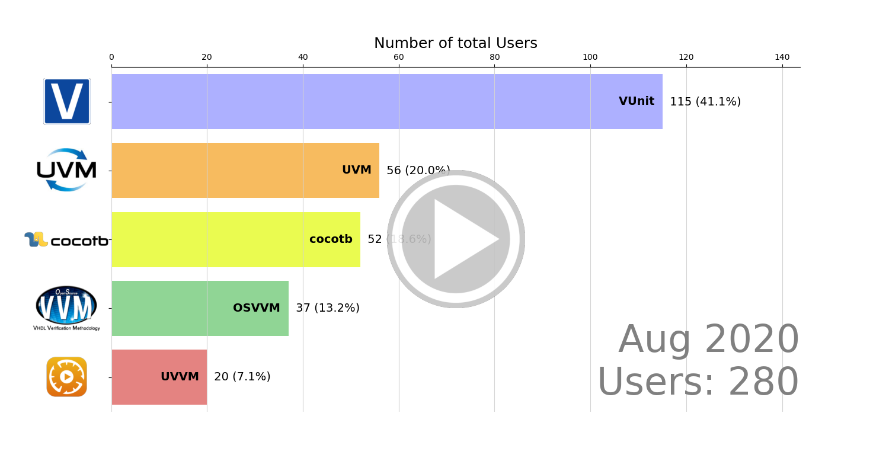

## Users

The user analysis is done by analyzing all commits to the **files using a standard framework**. Every commit author from the time the framework was introduced in the file and forward is logged as a user of that framework. Each user is classifed according to:

* A user that has committed to a professional repository is considered to be a professional user. Note that the user can be a student, but if there are professionals involved in the same project that student is considered to be working at a professional level.
* A user that is not at a professional level but has commits to an academic repository is classified as being an academic user.
* All other users are classified as unknown.

The list of users has also been checked for aliases. Two commit authors are consider to be the same user if:

1. They have the same email address and that address isn't a common default address such as `user@example.com`.
2. The user names are very similar. This is a judgement call but that judgement was aided by using the [Levenshtein distance](https://en.wikipedia.org/wiki/Levenshtein_distance) as a metric for the similarity between strings. The result of that analysis can be found in [`user_aliases.json`](https://(ref:repoTree)/user_aliases.json).

Figure \@ref(fig:total-user) shows the total number of users having experience with each framework. Looking at users rather than repositories (see Figure \@ref(fig:total-repo-mix)) doesn't have a drastic effect to the overall picture. **VUnit is still the most commonly used verification framework on GitHub**.

```{r total-user, fig.cap='Number of users using one or several frameworks.', echo=FALSE, out.width = '75%', fig.align='center', dev='svg'}
include_svg("img/total_user.svg")
```

Using the timestamp for each user's first commit allows to see how the situation depicted in Figure \@ref(fig:total-user) evolved over time. This is shown^[Animations/videos for each of the categories are available in the repo. See [`video/*_user_bar_race.*`](https://(ref:repoTree)/video/).] in Figure \@ref(fig:total-user-bar-race) (download video from [`total_user_bar_race.mp4`](https://(ref:repoTree)/video/total_user_bar_race.mp4)).

```{r total-user-bar-race, fig.cap='Number of users over time.', echo=FALSE, out.width = '100%', fig.align='center'}
if (knitr:::is_html_output()) {
  knitr::include_graphics("video/total_user_bar_race.gif")
} else {
  
}
```

A further breakdown of the users based on classification is shown in Figures \@ref(fig:professional-user), \@ref(fig:unknown-user) and \@ref(fig:academic-user).

```{r professional-user, fig.cap='Number of professional users using one or several frameworks.', echo=FALSE, out.width = '75%', fig.align='center'}
include_svg("img/professional_user.svg")
```

The same conslusions made for professional repositories still hold when analyzing professional users:

* **Most professional users using more than one framework use VUnit and OSVVM**.
* **More than half of the professional users using OSVVM also use VUnit**.
* **UVM is not combined with any other framework**.

```{r unknown-user, fig.cap='Number of unknown users using one or several frameworks.', echo=FALSE, out.width = '75%', fig.align='center'}
include_svg("img/unknown_user.svg")
```

The portion of unknown users is the same as the portion of unknown repositories (5%) and they do not affect the main conclusions.

```{r academic-user, fig.cap='Number of academic users using one or several frameworks.', echo=FALSE, out.width = '75%', fig.align='center'}
include_svg("img/academic_user.svg")
```

The academic view is a bit different from the corresponing view for repositories (see Figure \@ref(fig:academic-repo-mix)) in that the relative portion of VUnit users is higher. There are more academic VUnit users than users of the other frameworks combined. More research is needed to fully explain the differences between professional and academic framework usage but some insight can be gained by comparing the professional and academic trends as shown in Figures \@ref(fig:pro-trends) and \@ref(fig:academic-trends).

```{r pro-trends, fig.cap='Number of professional users over time.', echo=FALSE, out.width = '75%', fig.align='center'}
include_svg("img/professional_users_over_time.svg")
```

```{r academic-trends, fig.cap='Number of academic users over time.', echo=FALSE, out.width = '75%', fig.align='center'}
include_svg("img/academic_users_over_time.svg")
```

Overall the trends are stable or slowly changing with one notable exception. There is a drastic change in the number of academic VUnit users in early 2018. It’s always good to keep an eye on anomalies in the data. Are the numbers we see the result of a longer stable trend or caused by a special event? In the next section we will look deeper into this temporal anomaly and find its root cause. We will also look for spatial anomalies by examining the timezones from which the users operate. That will allow us to examine whether the trends we see are global or the results of local hotspots.

### How-To {#users-howto}

#### `analyze_users.py` {#analyze-users}

[`analyze_users.py`](https://(ref:repoTree)/py/analyze_users.py) makes a clone of all repositories using a standard framework, according to repository statistics ([`repos_stat.json`](https://(ref:repoTree)/repos_stat.json)) created by [`analyze_test_strategy.py`](https://(ref:repoTree)/py/analyze_test_strategy.py). Unlike default [`github_clone.py`](https://(ref:repoTree)/py/github_clone.py) use, git histories are preserved and repositories are not compressed. Furthermore, user statistics are extracted by scanning the Git history of all repositories, unlike the repository classification ([`repo_classification.json`](https://(ref:repoTree)/repo_classification.json)) and the list of user aliases ([`user_aliases.json`](https://(ref:repoTree)/user_aliases.json)).

The script produces a JSON file for each analyzed repository (`repo_name.user.1.json`) and also a summary JSON file. The name of the output file is given in the call.

``` console
python analyze_users.py \
  path/to/directory/with/cloned/repositories \
  path/to/repos_stat.json \
  path/to/repo_classification.json \
  path/to/user_aliases.json \
  path/to/user_stat.json
```

The result of our latest run is provided in [`user_stat.json`](https://(ref:repoTree)/user_stat.json).

#### `analyze_sample.py` {#analyze_sample}
The analysis of standard framework users also includes a comparison with the whole group of VHDL users on GitHub. This comparison is futher described in the next section. The VHDL users are collected from a random sample of VHDL repositories listed in [`sample_repos.txt`](https://(ref:repoTree)/sample_repos.txt). The sample repositories are first cloned using [`github_clone.py`](https://(ref:repoTree)/py/github_clone.py) with the `--no-zip` option set to prevent repository compression. Next, the [`analyze_sample.py`](https://(ref:repoTree)/py/analyze_sample.py) script is called to create a JSON file with the analysis result.

``` console
python analyze_sample.py \
  path/to/directory/with/cloned/sample/repositories \
  path/to/sample_user_stat.json
```

#### `visualize_users.py` {#visualize-users}

[`visualize_users.py`](https://(ref:repoTree)/py/visualize_users.py) creates the images and the video clips used in this post from the results generated by [`analyze_users.py`](https://(ref:repoTree)/py/analyze_users.py) and [`analyze_sample.py`](https://(ref:repoTree)/py/analyze_sample.py). The images and videos are saved to the output directories given in the call.

``` console
python visualize_users.py \
  path/to/user_stat.json \
  path/to/sample_user_stat.json \
  path/to/image_directory \
  path/to/video_directory
```
